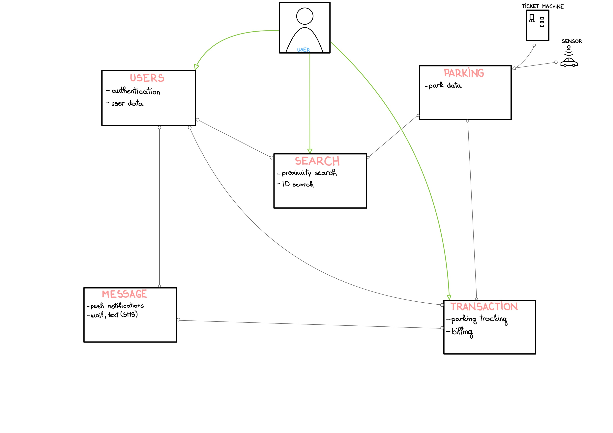

# ParkSearcher

V okviru projekta pri predmetu RSO na UL FRI sva razvila aplikacijo ParkSearch. Aplikacija omogoča iskanje prostih parkirišč. Implementira nekatere storitve, ki jih ponuja aplikacija *Easy Park*.

Aplikacijo sva zasnovala tako, da jo lahko v prihodnje še nadgradiva z mobilno aplikacijo, ki olajšuje uporabo same aplikacije.

## 1. Člani skupine in številka projektne skupine

Člana skupine `TODO` sva Mojca Kompara in Andraž Sovinec (projektna skupina št. 13).

## 2. Kratek opis projekta

Aplikacija ParkSearch omogoča uporabniku najti najbližjbližnja parkirna mesta. Izbira lahko med različnimi načini iskanja: po številu praznih parkirnih mest, bližina parkirišča željene lokacije in podobno. Parkirišča lahko išče glede na svojo trenutno lokacijo, ali pa vnese nek naslov, ki je nato uporabljen kot izhodišče za iskanje. Uporabnik lahko na izbranem parkirišču vnese koliko časa bo tam parkiral. Tudi plačilo parkirnine je možno kar preko aplikacije.

## 3. Ogrodje in razvojno okolje

Aplikacija bo narejena v programskem jeziku Java. Za programiranje bo uporabljeno razvojno okolje Visual Studio Code. Uporabljene bodo tudi tehnologije Docker, Node.js, REST, GraphQL in Postman.

## 4. Shema arhitekture

{ width=80% }

## 5. Seznam funkcionalnosti mikrostoritev

- **Users:** avtentikacija uporbnika, uporabniški profil (ime, priimek, uporabniško ime, geslo, telefonska številka, e-mail, nedavne transakcije in parkiranja, "favorites", plačilna kartica)
- **Search:** iskanje parkirišč glede na podano/željeno lokacijo, iskanje parkirišč v bližini
- **Transaction:** upravljanje plačil za parkiranje, avtomatsko "trganje" z kartice
- **Messages:** upravljanje z obvestili prek e-maila in telefonske številke, pošiljanje računa, obveščanje o poteku parkiranja, $\dots$
- **Parking:** upravljanje s podatki o parkiriščih in zasedenostih parkirnih mest

## 6. Primeri uporabe

- **Signup:** uporabnik kreira nov račun, podatki se shranijo v podatkovno bazo
- **Login:** uporabnik se vpiše v obsoječi račun, ustrezni podatki so pridobljeni iz podatkovne baze
- **Iskanje parkirišč:** uporabnik lahko išče parkirišča na podlagi izbranih parametrov, prikazana so parkirišča ki se z temi parametri ujemajo
- **Iskanje parkirišč v bližini uporabnika:** uporabnik pridobi informacije o parkiriščih, ki so v neposredni bližini njegove trenutne lokacije
- **Izbira časa parkiranja:** uporabnik na izbranem parkirišču določi, koliko časa bo imel avto tam parkiran
- **Plačevanje parkirnine:** uporabnik preko aplikacije plača parkirnino, podatki o ceni so pridobljeni iz parkomata
- **Branje sporočil:** uporabnik lahko bere sporočila, prejeta od aplikacije (npr. opozorilo o ne-plačani parkirnini)